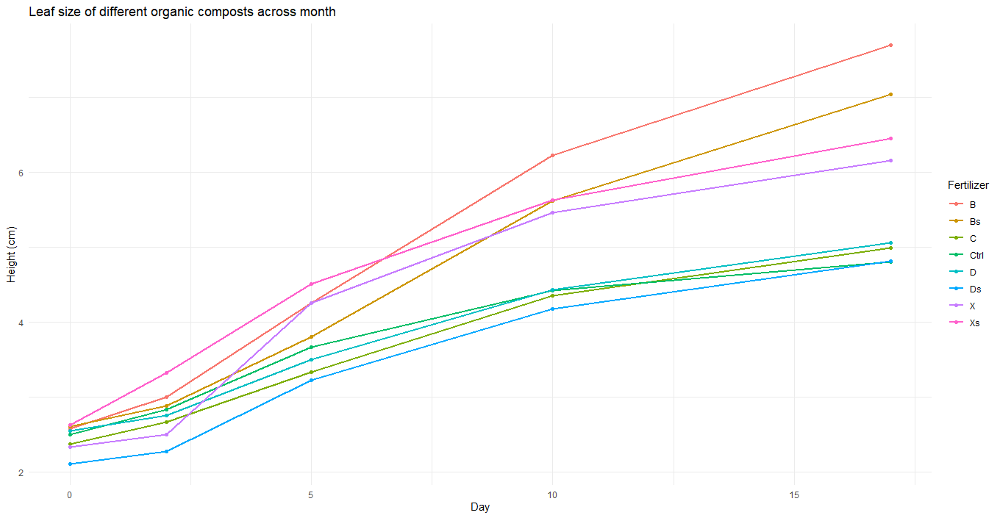
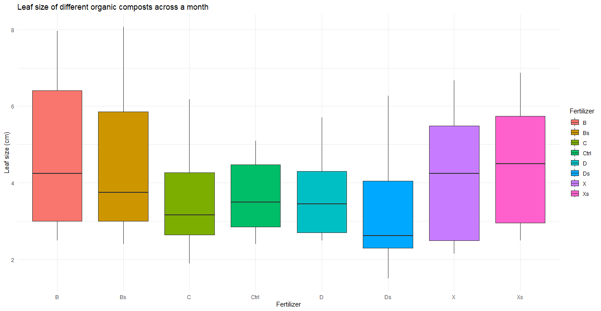

# Comparative Study of Organic Fertilizer Efficacy on the Leaf Growth of Brassica juncea

## 1. Project Introduction and Research Objectives
This study evaluates and compares the growth-promoting effects of various self-made organic fertilizers—derived from agricultural by-products such as banana waste and oilseed cake—on the leaf area development of *Brassica juncea*. In leafy vegetable cultivation, leaf area is a critical biological indicator of photosynthetic capacity and biomass accumulation. By applying advanced statistical modeling, this project aims to identify the optimal nutrient source for robust and sustainable plant development.

## 2. Research Methodology and Statistical Analysis
The experiment was designed with eight fertilizer treatments: Banana Waste (**B, Bs**), Oilseed Cake (**D, Ds**), Combined Mix (**X, Xs**), General Organic Waste (**C**), and a Control group (**Ctrl**).

### Analytical Workflow:
* **Statistical Modeling:** A **Linear Mixed Model (LMM)** was utilized to analyze repeated measures data. The individual plant identity (`PlantID`) was treated as a random effect to control for inherent biological variation between specific plants.
* **Assumption Testing:** * The **Shapiro-Wilk** test was used to confirm the normal distribution of residuals ($p = 0.342 > 0.05$).
    * **Levene’s Test** was applied to check for homogeneity of variance.
* **Post-hoc Comparisons:** **Tukey’s HSD** (Honest Significant Difference) tests were performed via `emmeans` to categorize significance groups, allowing for a precise distinction of the effects of each fertilizer type.

## 3. Research Results and Graphical Interpretation

### 3.1. Growth Dynamics Over Time
The ANOVA results from the mixed model confirmed a highly significant interaction between the fertilizer type and time ($F = 10.53, p < 0.001$). This demonstrates that the rate of leaf expansion is strictly dependent on the specific nutrient source provided.

| Source of Variation | Df | F value | Pr(>F) |
| :--- | :--- | :--- | :--- |
| Fertilizer | 7 | 2.889 | < 0.05 * |
| Day | 1 | 987.163 | < 0.001 *** |
| **Fertilizer:Day** | **7** | **10.530** | **< 0.001 *** |

*Figure 1: Leaf area growth dynamics over the 17-day experimental period.*

**Line Plot Interpretation:** The growth progression chart shows a clear divergence starting from Day 5. While the Control (Ctrl) and Oilseed Cake (D, Ds) groups maintained a low and steady growth rate, the **Banana Waste (B and Bs)** groups showed a strong upward surge. These groups achieved the highest growth slope, leading in leaf area consistently until the final day.

### 3.2. Comparative Efficacy at Harvest (Day 17)
By Day 17, the superiority of the banana waste fertilizer was most evident through estimated marginal means and statistical grouping.

| Treatment | Mean Leaf Area (cm) | Standard Error (SE) | Tukey Grouping |
| :--- | :--- | :--- | :--- |
| **Banana Waste (B)** | **7.70** | 0.447 | **a** |
| Banana Waste - Bag (Bs) | 7.04 | 0.316 | ab |
| Mixed - Bag (Xs) | 6.45 | 0.316 | ab |
| Control (Ctrl) | 4.80 | 0.365 | bc |

*Figure 2: Comparison of leaf area across treatments at the final time point.*

**Boxplot Interpretation:** The boxplot illustrates a complete separation of the **B** treatment from the other groups. Pairwise comparisons via `emmeans` confirmed that group B achieved the highest average leaf area (~7.7 cm), showing a highly significant difference compared to the control group ($p = 0.0006$). Despite slight variance within the B group (indicated by the box height), the superior median value identifies this as the optimal formula for promoting leaf biomass.

## 4. Discussion and Conclusion
The exceptional performance of banana waste can be attributed to its ability to provide timely mineral nutrients, particularly Potassium (K), which supports the cellular expansion of the leaf blade. The high **Fertilizer × Day** interaction index proves that banana waste fertilizer not only results in larger leaves at the final stage but also maintains a superior growth rate throughout the entire cultivation cycle.

**Conclusion:** This research confirms that **Banana Waste applied in black baskets (Group B)** is the most effective formula. The application of sophisticated statistical models has scientifically demonstrated that combining the right organic
